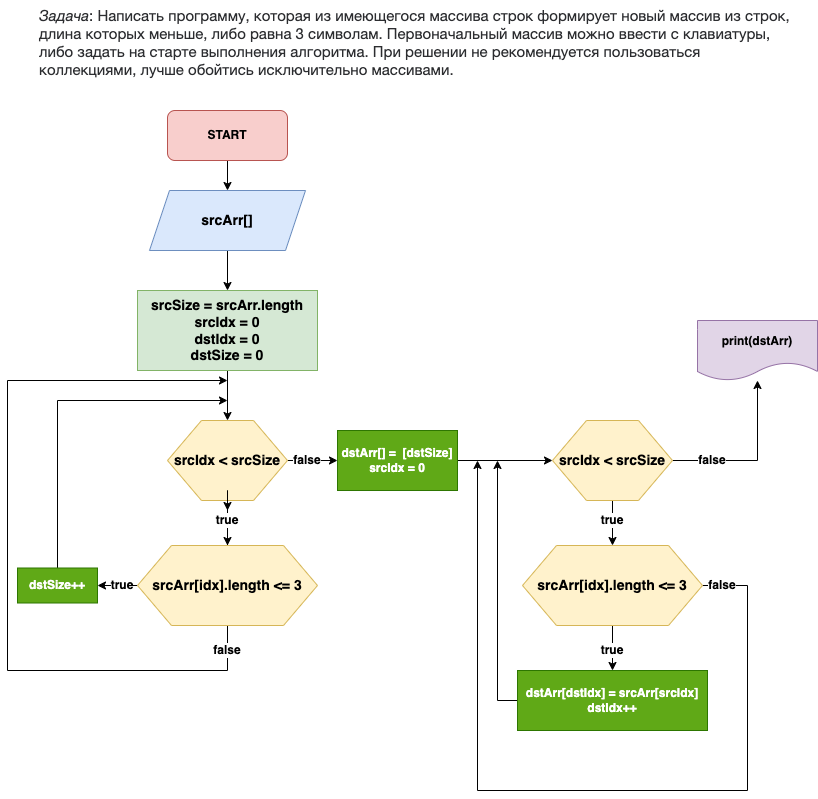

# Контрольная работа 

Предлагается такая блоксхема:

Принимаем вводные данные: массив вводится пользовтелем, длина его нам известна.

## Алгоритм

* Первым циклом проходим исходный массив и накапливаем размер для инициализации выходного массива. 

* После прохода инициализируем выходной массив с ранее определенным размером

* Проходим еще раз исходный (входной) массив, и по условию выборки заполняем выходной массив

### Работу выполнил студент группы 4869

Сергей Королев
https://github.com/seregakingoff